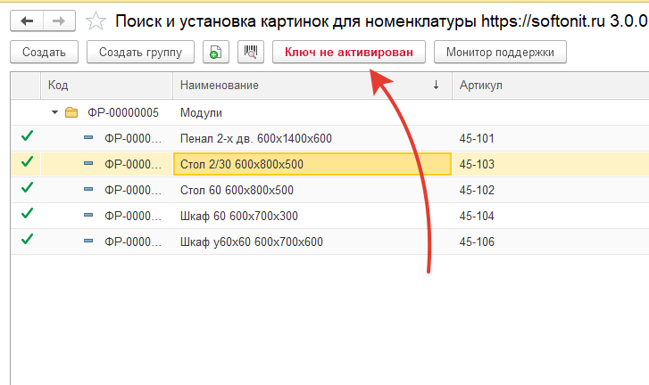
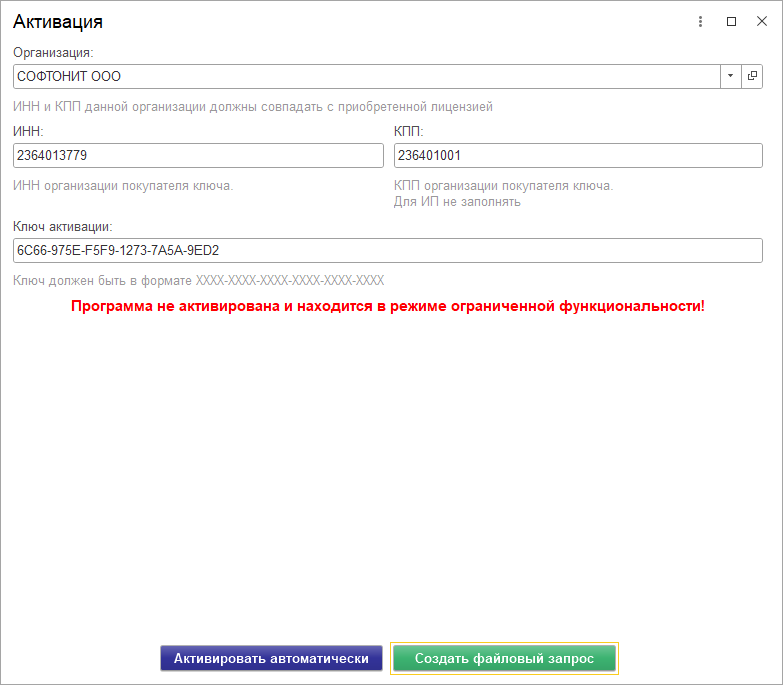
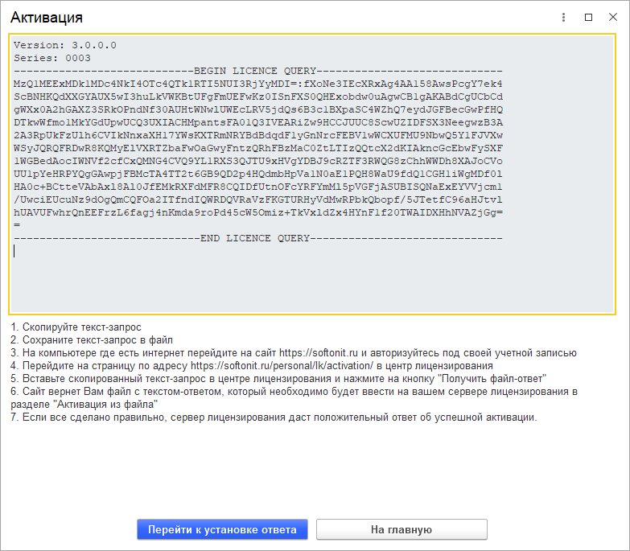
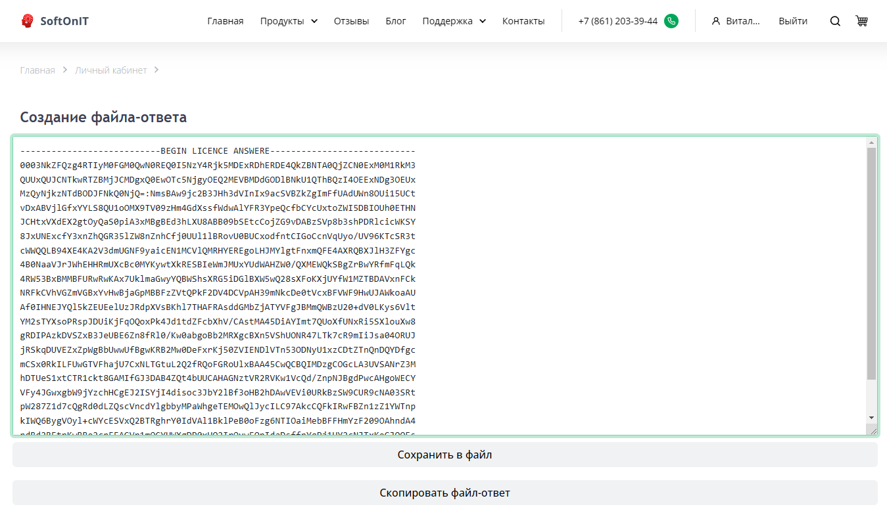
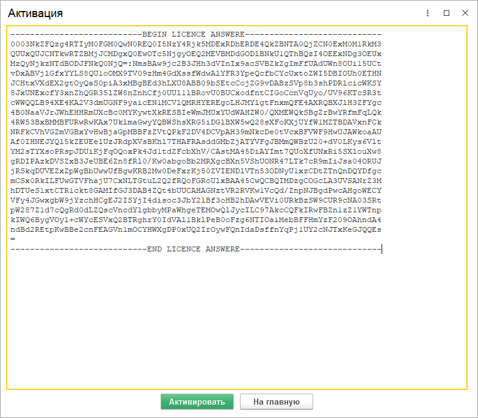
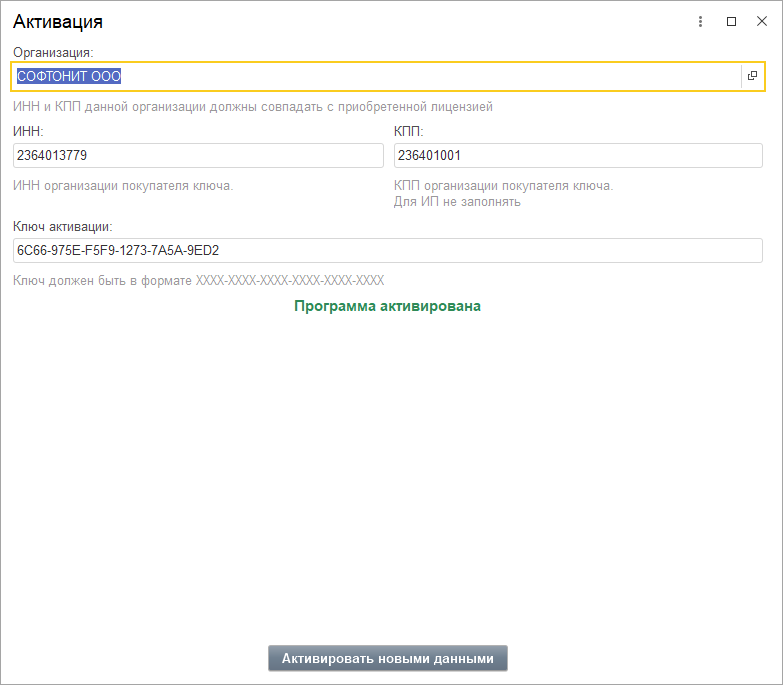

# Активация

Обработку перед использованием необходимо активировать, иначе она будет работать в демо-режиме и с ограничениями.

## Установка обработки

1. Откройте обработку и нажмите вверху обработки кнопку "Ключ не активирован"

2. В открывшейся форме выберите организацию и проверьте ИНН и КПП организации которая купила обработку. А так же заполните поле "Ключ активации". Эти данные вы получите в письме на вашу электронную почту при покупке.

3. После проверки введенных данных, если на компьютере есть интернет, то нажмите на кнопку "Активировать автоматически". После этого конфигурация будет активирована и вы перейдете на п.5.
4. Если интернета на компьютере нет, то нажмите на кнопку "Создать файловый запрос".

4.1. Скопируйте текст-запрос;
4.2. Сохраните текст-запрос в файл и скопируйте на флешку;
4.3. На компьютере где есть интернет перейдите на сайт [https://softonit.ru](https://softonit.ru) и авторизуйтесь под своей учетной записью;
4.4. Перейдите на страницу по адресу [https://softonit.ru/personal/lk/activation/](https://softonit.ru/personal/lk/activation/) в центр лицензирования;
4.5. Вставьте скопированный текст-запрос в центре лицензирования и нажмите на кнопку "Получить файл-ответ";
4.6. Сайт вернет Вам файл с текстом-ответом, который необходимо будет ввести на вашем сервер лицензирования в разделе "Активация из файла". Возвращаемся на компьютер где проводим активацию и нажимаем на кнопку "Перейти к установке ответа".

4.7. Нажимаем в 1С кнопку "Активировать" и переходим на п.5.

5. Программа активирована и появится сообщение "Программа активирована".

