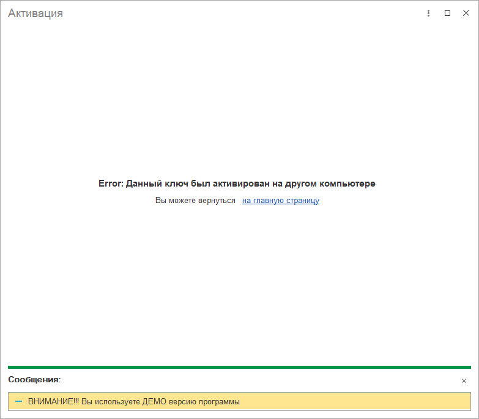

# Данный ключ был активирован на другом компьютере

Вот такая ошибка:

Означает, что этот ключ был уже использован на другом компьютере или информационной базе. Необходимо повторно сгенерировать ключ активации.

Это можно сделать самостоятельно на странице [Ключи активации](https://softonit.ru/personal/lk/keys/)

В месяц можно воспользоваться перегенерацией не более трех раз, если больше, то нужно позвонить нашему менеджеру и после пояснении, вам предоставят новый ключ.