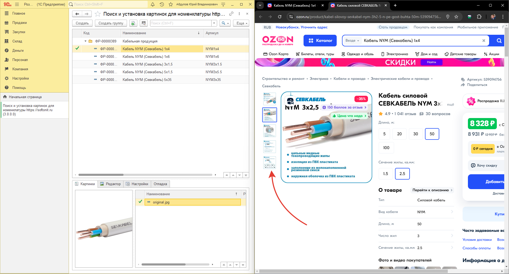
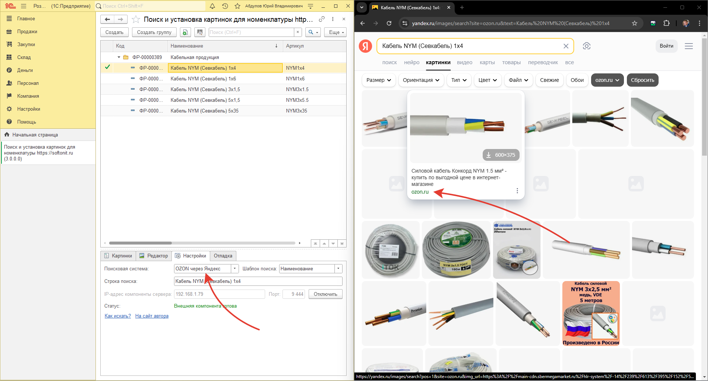

# Для Ozon надо постоянно проваливаться в каждую карточку и открывать каждое изображение, а это не очень быстро. Как быть?

Да. Это долго. Из поиска ozon нужно перейти сначала в карточку товара, а уже потом нажать кажду картинку и перенести ее в 1С.

Выход есть. В обработке 1С, на вкладке настройка укажите поисковая система `Ozon через Яндекс`. Будут найдены все изображения на Ozon для указанного товара, но используя поиск Яндекса.

