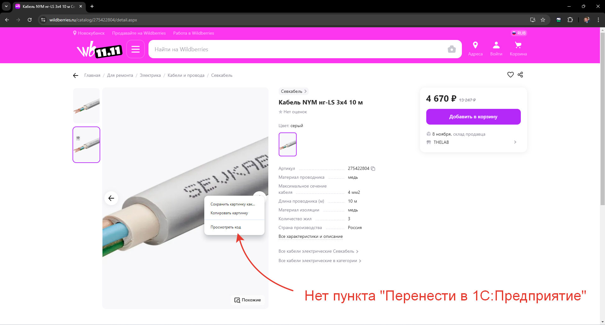
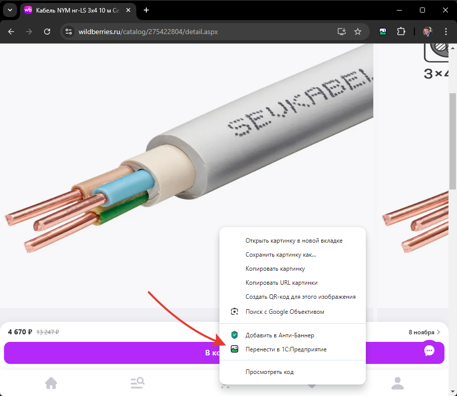
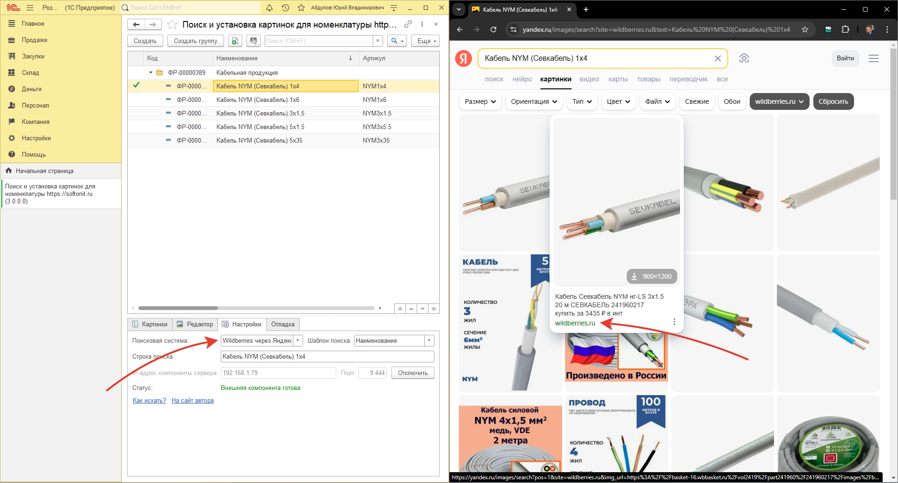

# Хочу загрузить картинку с Wildberries (WB), но у меня не получается выбрать картинку. Что делать?

Действительно при работе с WB, есть проблема с картинками. В браузере крайне трудно выбирать изображение. Так как:

* Для Wildberries (WB) изображение увеличивается
* В меню нет пункта `Перенести в 1С:Предприятие`

## Решение 1

Уменьшите окно браузера в размерах. В этом случае возможность переноса появится.

## Решение 2

В обработке 1С, на вкладке настройка укажите поисковая система `Wildberries через Яндекс`. Будут найдены все картинки на WB для указанного товара, но используя поиск Яндекса.

