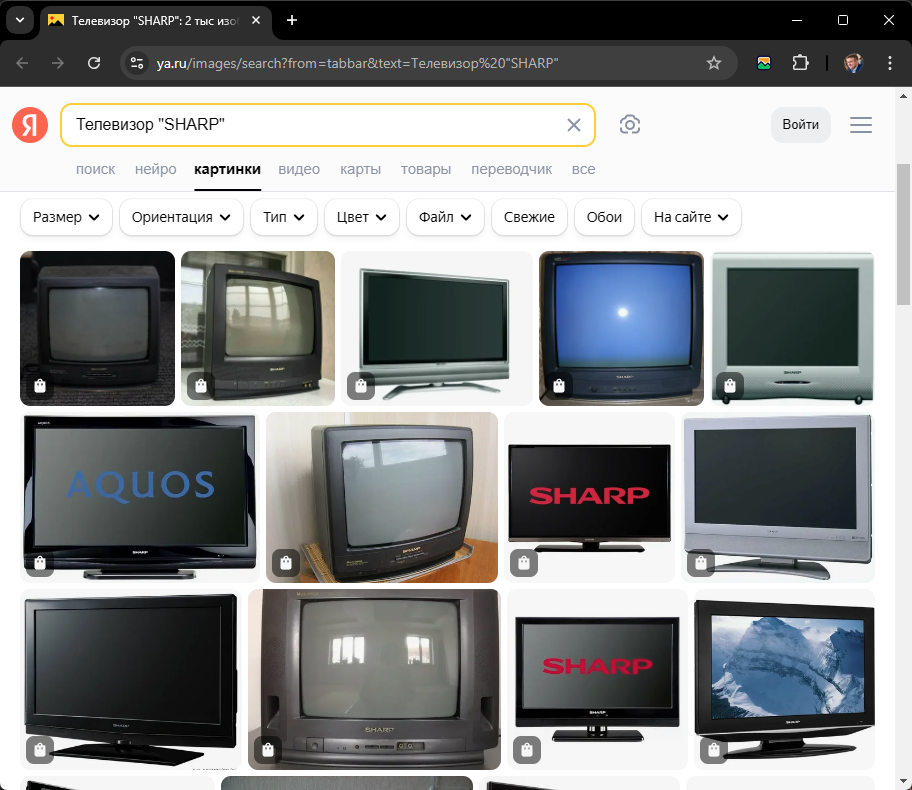

# Почему могут не находиться изображения?

1. Не верная строка поиска. Например, ищите не те строки, если ввести: `Телевизор "SHARP"`, то будет вот это:

А если же искать, что-то типа: `Телевизор SHARP "45" высокого качества с артикулом 0745878965422578522`, то понятное дело ничего не будет найдено.

Слишком сложная строка для поиска и не удивляйтесь, если Яндекс или Google ничего не находит по ней.

Упростите строку поиска вручную в браузере.

2. По этой строке поиска в интернете действительно ничего нет. Это может быть редко встречающийся товар, или изображения этого товара просто нет в природе. Совет тот же: изменяйте строку поиска.

3. Сайты могут закрывать индексирование своих картинок от поисковиков. И поэтому Яндекс или Google могут их не найти. Картинка вроде бы есть, но Яндекс или Mail получили инструкции от создателей сайтов не добавлять их в поиск и поэтому их там нет.

4. При очень большом количестве запросов Яндекс или Mail сам может заблокировать вывод картинок, так как может подумать что вы бот и у Вас подозрительная активность. В этом случае будет необходим ввод Captcha.
