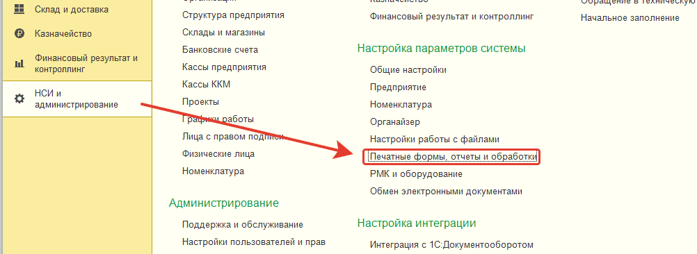

# Первоначальная установка

Первоначальная установка состоит из нескольких этапов. Их необходимо выполнить последовательно.

## Этап 1. Установка обработки в 1С

Для запуска обработки в конфигурации достаточно выбрать в главном меню пункт меню `Файл` -> `Открыть`, но для постоянного использования в работе обработку следует подключить к конфигурации.  

Рассмотрим подключение обработки на примере конфигурации **"Управление торговлей 11.2"**.

1. Необходимо войти в конфигурацию под пользователем с административными правами.
2. Далее, в разделе `НСИ и администрирование` -> `Настройка параметров системы` -> `Печатные формы, отчеты и обработки` (рис.1)  раскрыть группу `Отчеты и обработки`, установить флажок `Дополнительные отчеты и обработки` (если еще не установлен) и открыть список `Дополнительные отчеты и обработки` (рис.2).

3. В открывшемся списке необходимо нажать кнопку `Создать` и выбрать ранее сохраненный файл обработки `Поиск и установка изображений для номенклатуры`.
4. Далее необходимо указать размещение команды вызова обработки (например, раздел `Склад и доставка`) и нажать `ОК`:

5. В столбце "Быстрый доступ" необходимо указать пользователей, которым будет видна команда открытия обработки, нажать `ОК`:

6. В окне подключения обработки необходимо нажать кнопку `Записать и закрыть`.

На этом подключение обработки завершено.

## Этап 2. Подготовка браузера

1. Установите один из браузеров, который поддерживается обработкой: [Яндекс Браузер](https://www.browser.yandex.ru/), [Google Chrome](https://www.google.com.au/intl/ru_ru/chrome/), [Microsoft Edge](https://www.microsoft.com/ru-ru/edge/download). Выбирайте любой на выбор, если у вас он не установлен, установите.
2. Запустите браузер и установите в нем расширение (откройте ссылку ниже в открытом браузере): [Установить](https://chromewebstore.google.com/detail/%D1%83%D1%81%D1%82%D0%B0%D0%BD%D0%BE%D0%B2%D0%BA%D0%B0-%D0%B8%D0%B7%D0%BE%D0%B1%D1%80%D0%B0%D0%B6%D0%B5%D0%BD%D0%B8%D0%B9-%D0%B2-1/digojineikfmoicjapebdglhmiceacba). На открывшейся вкладке нажмите `Установить`.
3. Закрепите расширение.

В панели должен появится значок:

## Этап 3. Настройка связи расширения и конфигурации 1С

## Определяем IP-адрес локального компьютера

1. Запустите 1С и нашу обработку по поиску картинок.
2. Нажимаем на клавиатуре кнопки `Win + R` и в открывшемся окне ввести `powershell` (либо щелкаем правой кнопкой по меню `Пуск` и выбираем в Windows 10 `Windows PowerShell`, в Windows 11 это будет `Терминал`).
3. В терминале необходимо ввести команду `ipconfig` и мы получим сетевые соединения Windows:

Может вывестись несколько адресов (как на нашем скриншоте). Наш искомый выделен на скриншоте IPv4-адрес. Как правило ваш искомый IP-адрес будет начинаться `192.168...`.

4. В обработке необходимо открыть вкладку `Настройки` и в ней указать IP-адрес из шага выше. После чего нажать на кнопку `Подключить`.

Статус должен измениться на "Внешняя компонента готова". См. ниже:

5. Далее настроим браузер для работы с 1С. Откройте браузер щелкните по расширению и введите найденный IP:

6. Нажмите на переключатель "Использование"

**Важно!** Значок в расширении браузера должен изменить цвет на сверху рыжий, снизу зеленый.
Если этого не произошло, необходимо вернутся на шаг 3 и попробовать другой IP-адрес. Обратите внимание 1С должна быть открыта

7. Если у вас связь с 1С не заработала, то необходимо взять другой IP-адрес из шага 3.
8. Если цвет значка расширения в браузере изменился (сверху рыжий, снизу зеленый), нажмите на кнопку `Захватить эту вкладку`. После того, как вы это сделаете значок расширения должен изменить цвет: сверху белый, снизу зеленый:

После этого можете приступать к массовому [поиску и установке изображений](/Поиск и установка изображений/Поиск изображений.md).