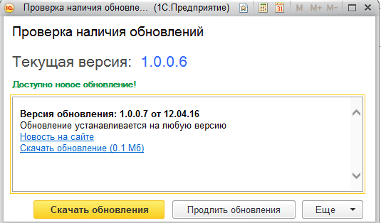
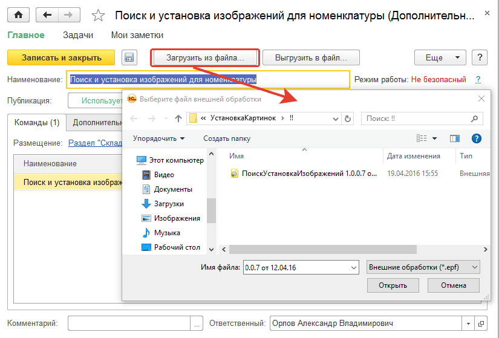

# Проверка и установка новой версии обработки

## Проверка обновления и установку новой версии обработки

Мы постоянно развиваем наши решения, дополняем и улучшаем имеющийся функционал. Для того, чтобы у Вас всегда была самая актуальная версия, в обработку встроена проверка обновления. Уведомление об имеющемся обновлении, представлено на рисунке

При переходе по ссылке `Новость на сайте` откроется страница нашего сайта с описанием новой версии обработки: изменения функционала, отличия о предыдущих версий и т.д.

При переходе по ссылке `Скачать обновление` или нажатии кнопки `Скачать обновления` будет открыта страница нашего сайта "Личный кабинет", в котором, после авторизации, Вы сможете скачать обновленную версию обработки "Поиск и установка изображений для номенклатуры" (при наличии действующей подписки на обновление).

По кнопке `Продлить обновления` будет открыта страница нашего сайта с предложением продления подписки на обновления.

Установка новой версии обработки практически совпадает с описанным в предыдущем уроке способом установки, с той разницей, что в п.3 вместо Создать необходимо выбрать ранее подключенную обработку  "Поиск и установка изображений для номенклатуры" и по кнопке `Загрузить из файла`, в открывшемся окне выбора файла указать файл с новой версией обработки:

