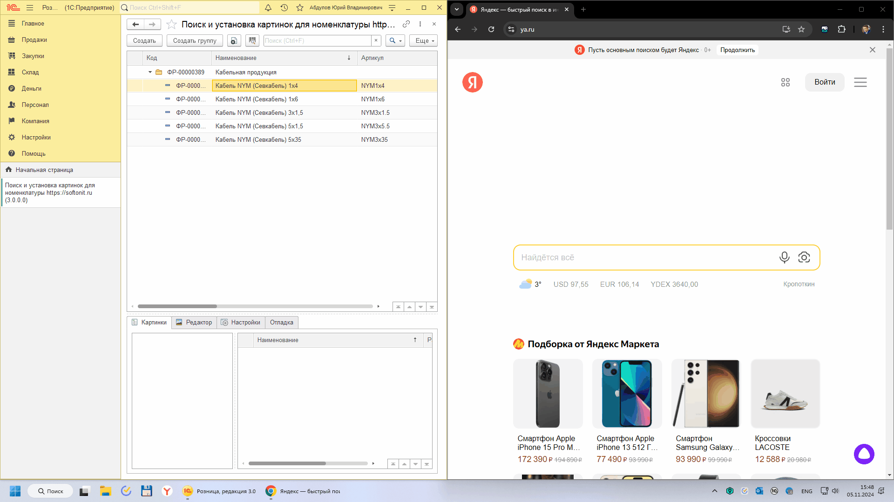
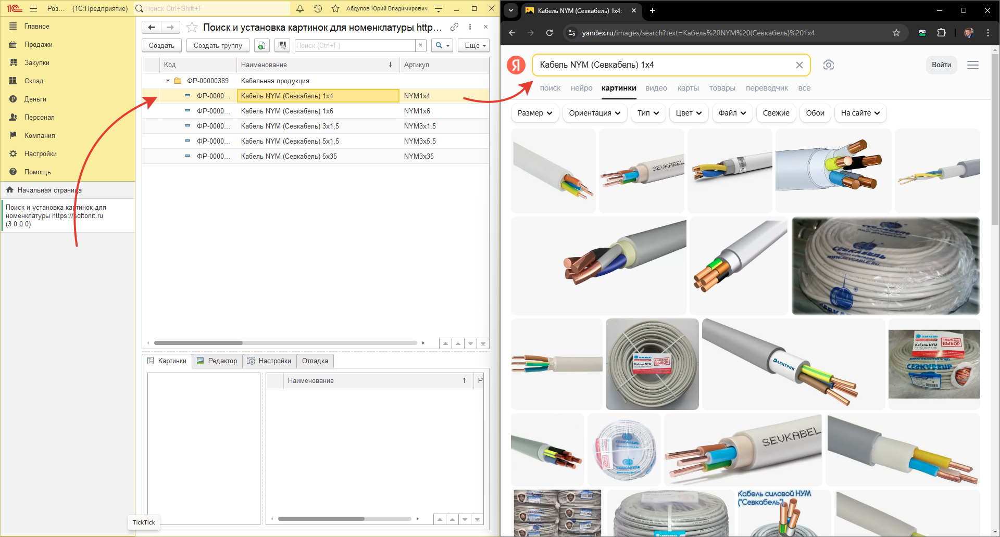
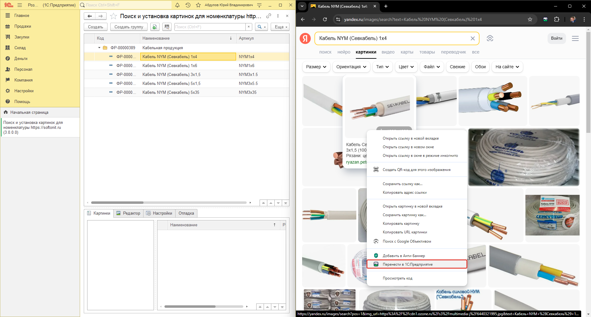
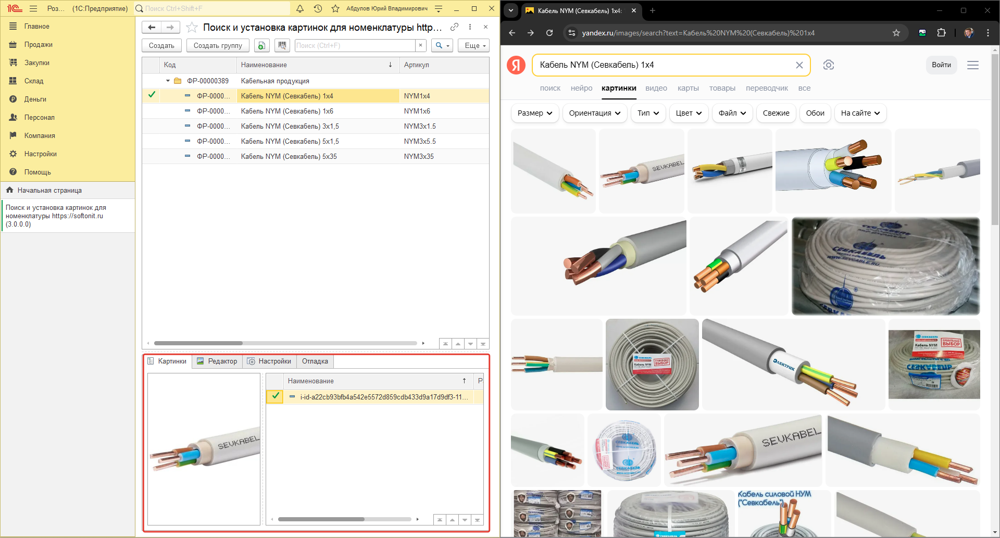

# Как выполнять поиск изображений

## Алгоритм работы

Обработка в связке с расширением браузера работает следующим образом:

1. Откройте браузер и настройте расширение.
2. Делите монитор на 2 части и в одной открываете 1С (слева), а в другой браузер (справа). Если у вас два подключенных монитора, то можно браузер открыть на одном, а 1С на другом.
3. В 1С выбираете нужную номенклатуру для которой хотите загрузить изображение и два раза щелкаете на номенклатуре в 1C.

4. В браузере, в зависимости от настроек в 1С будет открыт сайт с картинками (например Яндекс, или Google, или любой другой сайт откуда вы хотите загрузить изображения). Необходимо щелкнуть правой кнопкой мыши по одной из найденных картинок в браузере и нажать `Перенести в 1С:Предприятие`.

5. Выбранная в браузере картинка будет загружена в конфигурацию 1С.

6. Щелкаем правой кнопкой по следующей картинке, которая нам понравилась и повторяем процесс переноса в 1С.

## Важные моменты

Обратите внимание, на следующие пункты:

1. В браузере мы можем переходить по любым ссылкам в поиске и устанавливать изображения. Открыть даже другие сайты и "бродить" по ссылкам там.
2. Переходить на другие вкладки и там щелкать правой кнопкой мыши и переносить в 1С.
3. Если в момент двойного щелчка в 1С по номенклатуре есть захваченная вкладка, но она сейчас не активна, то в ней будет открыт поиск и она сделается активной вкладкой.
