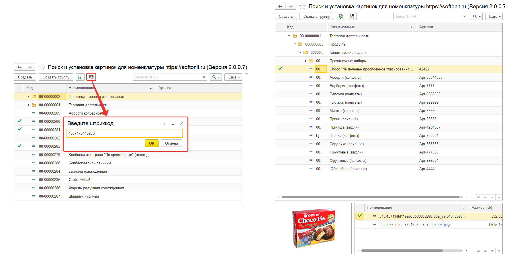

# Поиск по штрихкоду

Также можно искать номенклатуру по штрихкоду. Для этого нужно нажать на кнопку `Найти по штрихкоду` или с помощью горячей клавиши `F7`, ввести штрихкод, и если номенклатура будет найдена, то произойдет переход к текущей номенклатуре и автоматический поиск картинки в интернете:

Поиск по штрихкоду осуществляется аналогично в конфигурации **Управление торговлей 10.3**.
