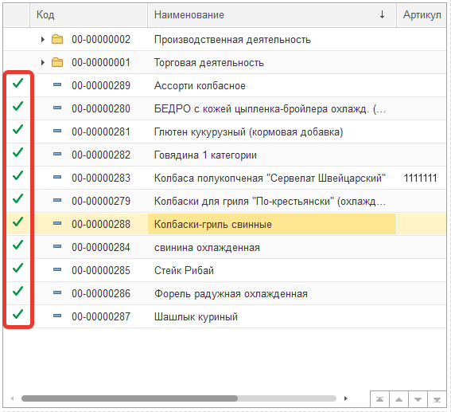
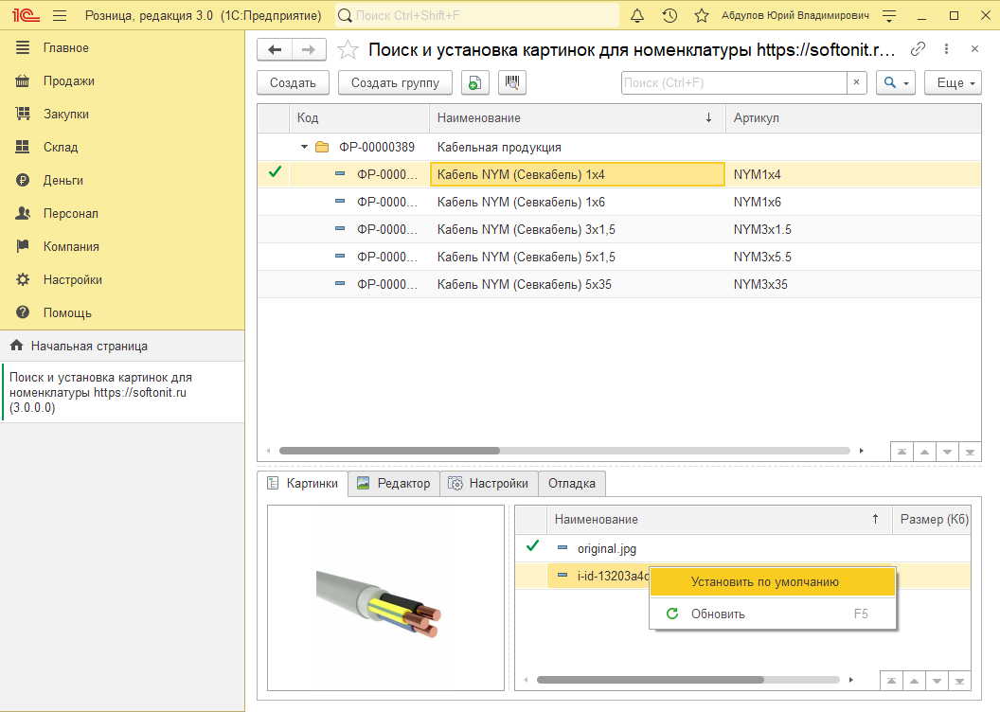

# Работа с изображениями

На панели групп и списка номенклатуры отображаются галочки, которые указывают на то, что данная номенклатура имеет установленное изображение по умолчанию. 

Для того, чтобы установить для номенклатуры изображение по умолчанию необходимо в списке ранее добавленных картинок правым кликом по нужном изображению вызвать команду `Установить по умолчанию`.

Установка по умолчанию осуществляется аналогично в конфигурации **"Управление торговлей 10.3"**.

Так же, картинки в этом списке можно помечать на удаление, открывать, изменять наименование.
