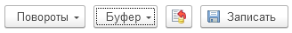
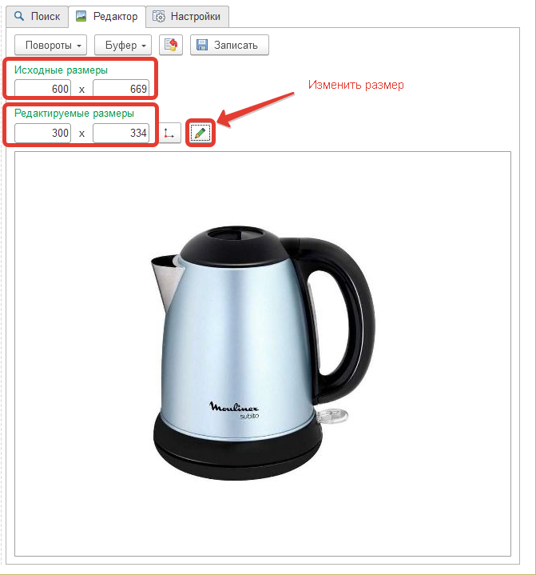
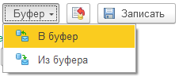
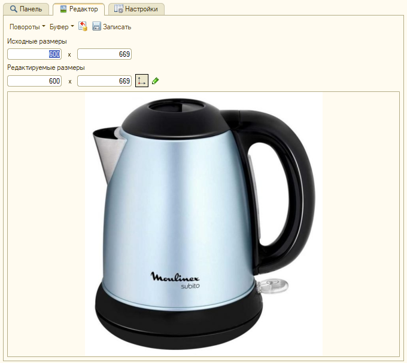

# Работа с редактором изображений

## Редактор изображений

Данная обработка имеет свой встроенный редактор изображений с помощью, которого можно поворачивать, изменять размеры картинки, а также работать с буфером обмена.

Вверху редактора расположены кнопки:

* **Повороты** - кнопка осуществляет поворот влево\вправо, а также позволяет отразить по вертикали\горизонтали;  
* **Буфер** - позволяет загружать или выгружать изображения в буфер обмена;  
* **Сбросить изменения** - позволяет откатить внесенные изменения;  
* **Записать** - позволяет сохранить внесенные изменения.  

Аналогичные кнопки находятся в **Управление торговлей 10.3**

Ниже расположены значения исходных значений картинки, а также редактируемые размеры, которые мы можем изменить.  
Например, исходные размеры `600х669` необходимо уменьшить в два раза.  
Введем в редактируемые поля новые значения `300х334` и для применения этих значений нажмем кнопку `Изменить размер`.  
В результате, изображение будет изменено относительно новой длины и ширины.

Если перед редактированием размеров изображения нажать  кнопку:   

тогда при изменении, например, одной только длины, размер ширины будет выставлять пропорционально.  

Для того, чтобы вставить или скопировать картинку буфера необходимо вверху редактора нажать кнопку `Буфер` и выбрать нужное действие.

## Редактор изображений аналогично выгладит в "Управление торговлей 10.3"

