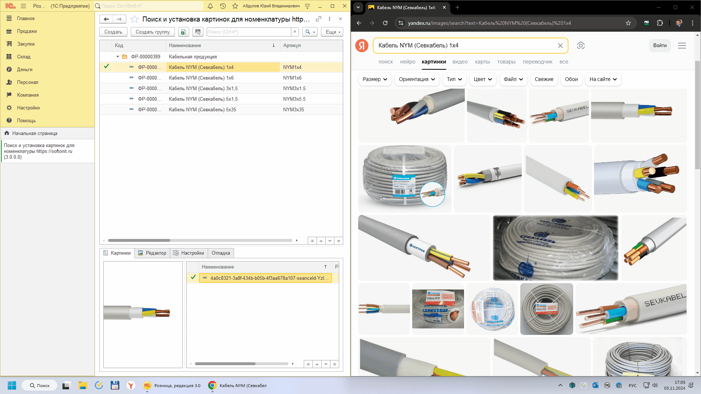

# Установка изображений в 1С из браузера через буфер обмена

Иногда так бывает, что разработчики сайтов делают изображения такими, чтобы они не были для расширения похожи на картинки. Т.е. расширение браузера не может понять, что в этом блоке кода сайта есть картинка. В этом случае, можно установить изображение через буфер обмена. Для этого необходимо:

1. Щелкнуть правой кнопкой по картинке и нажать пункт `Копировать картинку`.
2. Щелкнуть правой кнопкой мыши в любой области браузера и выбрать пункт `Из буфера обмена в 1С:Предприятие`.

Если в момент нажатия кнопки `Из буфера обмена в 1С:Предприятие` в 1С будет активна вкладка **Редактор**, то картинка вставится только в это окно и ее можно будет изменить перед записью. Автоматической установки изображения не будет!
